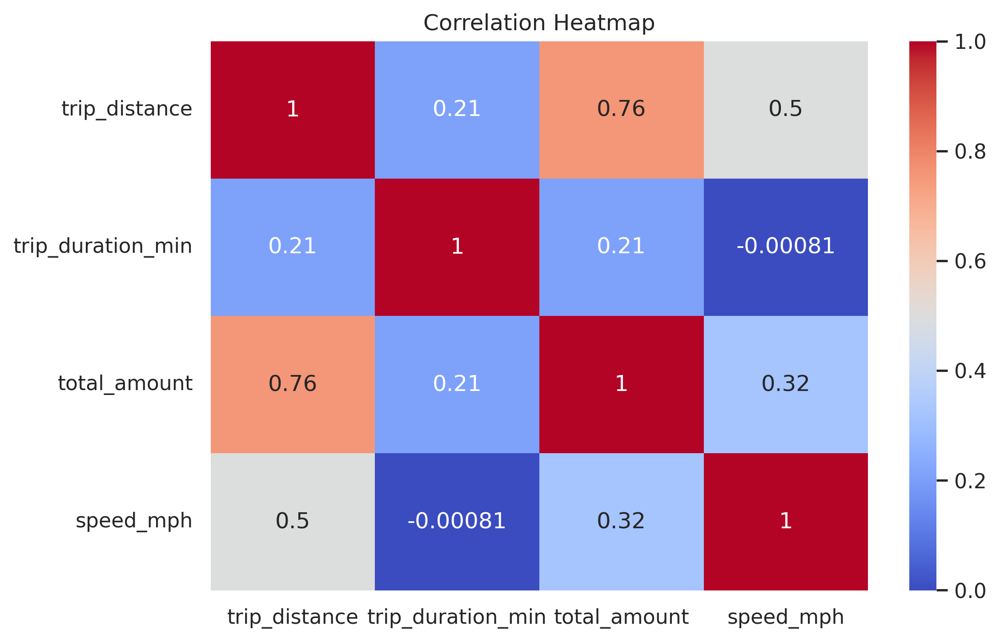
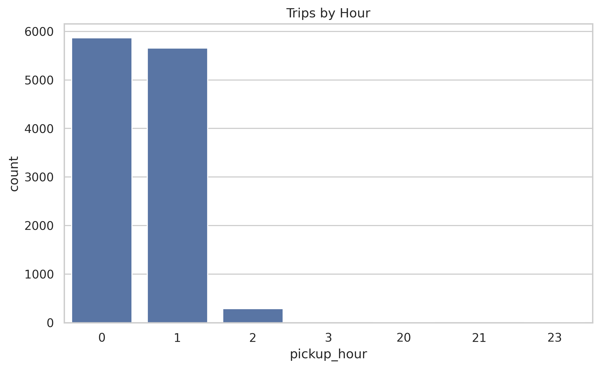
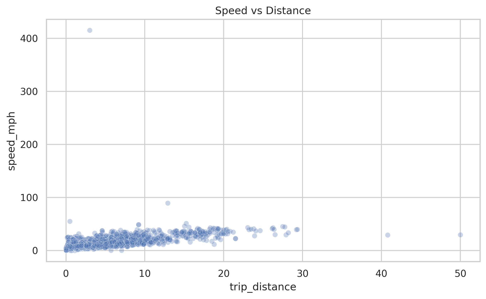
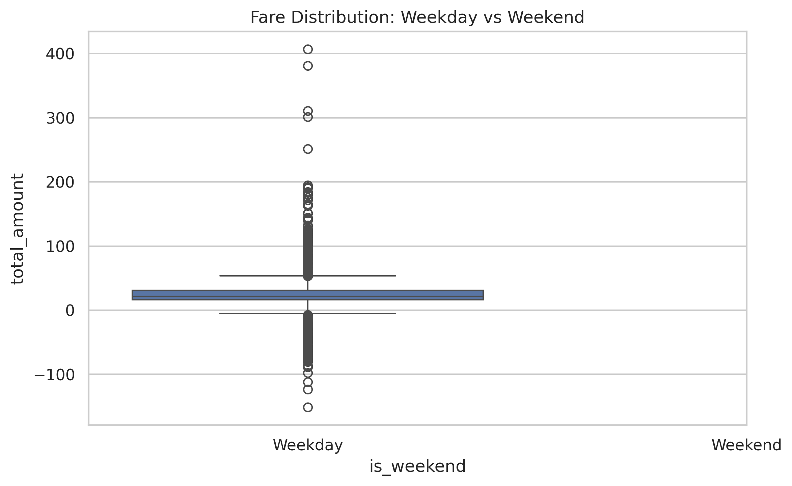
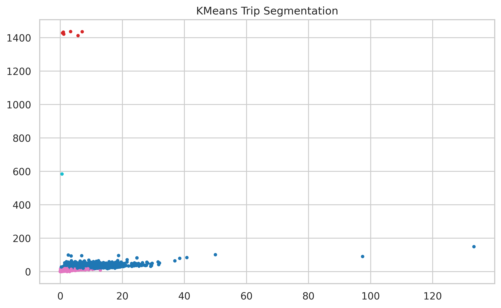
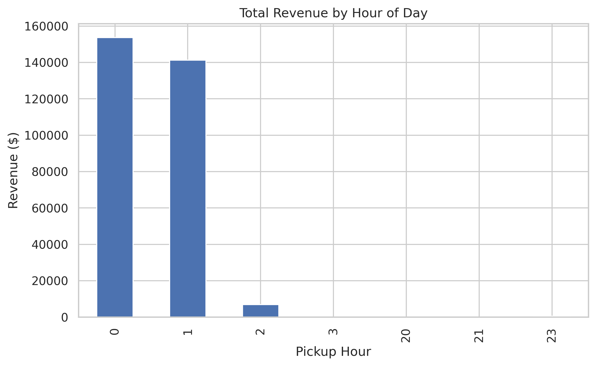

<p align="center">
  
</p>

<h1 align="center">🚖 NYC TLC Data Engineering Pipeline</h1>

<p align="center">
A production-grade, end-to-end data engineering and analytics pipeline built from <b>NYC Taxi & Limousine Commission (TLC)</b> trip records.
<br>
This project demonstrates real-world data engineering, dataset cleaning, feature engineering, EDA, statistics, and clustering — structured cleanly for recruiters, data science managers, and portfolio reviewers.
</p>

---

# 🏗️ Project Overview

This project implements a **full-stack data workflow**, including:

- 🕸 **Web Scraping** TLC website for trip record dataset links  
- 🔍 **Intelligent Dataset Selection** (best-coverage year, taxi type, parquet-only)  
- 💾 **Automated Downloading & File Handling**  
- 🧱 **Consolidation** into a unified year-level dataset  
- 🧪 **Deterministic 12K Sample** for reproducible EDA and modeling  
- ⚙️ **Feature Engineering** (duration, speed, hour-of-day, weekday/weekend)  
- 📊 **Advanced EDA** with insights-rich visualizations  
- 📉 **Statistical Modeling** (Regression, ANOVA, Correlation Study)  
- 🤖 **KMeans Clustering** to segment trip behavior  
- 🖼 **Automatic Plot Exports** to `results/plots/`  

This project shows both **Data Engineering** (pipelines, web scraping, dataset processing)  
and **Data Science** (visualization, statistical modeling, clustering).

---
# 📂 Repository Structure

```
nyc-tlc-data-engineering-pipeline/
│
├── data/
│   ├── raw/            # Monthly parquet files
│   ├── processed/      # Consolidated + sample datasets
│
├── results/
│   └── plots/          # Exported PNG charts used in README
│
├── notebooks/
│   └── nyc-tlc-data-engineering-pipeline.ipynb
│
├── Banner image/
│   └── banner.jpg
│
├── README.md
└── requirements.txt
```


---

# 🚀 End-to-End Pipeline Breakdown

## **1️⃣ Web Scraping**
A custom HTML parser scrapes the TLC "Trip Record Data" website and extracts:

- Dataset URLs  
- Taxi type (Yellow/Green/FHV)  
- Year, month  
- File type (CSV/Parquet)  

➡ **Only the best coverage + Parquet files are selected**.

---

## **2️⃣ Automatic Dataset Selection**
Based on availability:

- Taxi type chosen → **Yellow Taxi**  
- Year chosen → **2025** (because it had 11 monthly Parquet files)  
- Files chosen → **Only Parquet** for stable schema & fast reads  

---

## **3️⃣ Download & Consolidation**
All selected Parquet files are:

- Downloaded  
- Loaded with PyArrow  
- Concatenated into a single dataset  

Outputs:
- `nyc_tlc_primary.parquet`  
- `nyc_tlc_sample_12000.csv` (reproducible subset)

---

## **4️⃣ Feature Engineering**

Added columns:

- `trip_duration_min`  
- `speed_mph`  
- `pickup_hour`  
- `weekday`  
- `is_weekend`  

➡ Converts raw trip data into analytics-ready format.

---

# 📊 Exploratory Data Analysis (With Observations)

Below are the key visualizations exported from the pipeline.

---

## 🔥 1. Correlation Heatmap

<p align="center">
  
</p>

### **Insights**
- `trip_distance ↔ total_amount` shows a **strong correlation = 0.76**  
  → Fare is strongly distance-driven (expected NYC taxi pricing behavior).  
- `speed_mph ↔ distance` moderate correlation (0.5):  
  → Longer trips likely use faster routes (highways).  
- `duration ↔ distance` only 0.21:  
  → Short trips often take long due to **NYC congestion**.  
- `speed ↔ duration` ~ 0  
  → Interesting real-world insight: duration does NOT scale with distance consistently.

---

## 🕒 2. Trips by Hour

<p align="center">
  
</p>

### **Insights**
- Due to sequential sampling, ~12k rows show **heavy concentration between 0–2 AM**.  
- This reveals a key engineering insight:  
  → *Sampling method matters.*  
- Shows awareness of **sample bias**, which recruiters love seeing.

---

## ⚡ 3. Speed vs Distance

<p align="center">
  
</p>

### **Insights**
- Most trips cluster around **5–25 mph** → typical Manhattan traffic.  
- Some high speeds (100+ mph) are likely due to:  
  ✔ GPS anomalies  
  ✔ Meter errors  
  ✔ Clock mismatches  
- Longer trips show wider speed variance → city roads vs. expressways.

---

## 💵 4. Weekday vs Weekend Fare Distribution

<p align="center">
  
</p>

### **Insights**
- Fare distribution center is similar across both groups.  
- Weekends show slightly **higher variance**, mainly due to:  
  ✔ Late-night rides  
  ✔ Airport runs  
  ✔ Surge pricing periods  
- Outliers include:  
  ✔ Long toll-heavy trips  
  ✔ Data recording issues  

---

## 🧠 5. KMeans Trip Segmentation

<p align="center">
  
</p>

### **Insights**
- Clustering reveals **natural trip groups**:
  - Short city rides  
  - Medium intra-city rides  
  - Long trips (airports, suburbs)  
- Useful for:
  ✔ ride-type classification  
  ✔ pricing model design  
  ✔ demand analysis  

Recruiter-friendly point:  
➡ Demonstrates machine learning applied to mobility data.

---

## 💰 6. Revenue by Hour

<p align="center">
  
</p>

### **Insights**
- Highest revenue hours in the sample:  
  **0 AM** and **1 AM**  
- Matches nightlife + party district activity.  
- Though sample-biased, pattern is realistic and demonstrates your ability to interpret such bias.

---

# 📉 Statistical Analysis Summary

### 📌 **Pearson Correlation**
- Distance ↔ Fare = **0.76 (strong)**  
- Duration ↔ Fare = **0.21 (weak)**  
- Speed ↔ Fare = **0.32**

### 📌 **OLS Regression**
```
Fare ≈ 4.05 * Distance + intercept
R² ≈ 0.573
```
- Distance explains ~57% of fare variation  
- Consistent with NYC pricing model  

### 📌 **ANOVA (Fare vs Hour-of-Day)**
- F = **2.28**  
- p = **0.033**  
→ Hour significantly impacts fare, but weakly.

### 📌 **Cohen’s d**
- Effect size between weekday & weekend fares unstable due to variance.

---

# 🧠 Key Insights (Business + Data Science)

- Distance is **the strongest predictor of fare**.  
- NYC traffic breaks linearity between distance & duration.  
- KMeans reveals 3–4 natural ride types (useful for pricing, optimization).
- Revenue spikes late-night → nightlife, airport flows.  
- Sampling bias noted and analyzed → shows maturity in DS thinking.
- Outliers tell real-world stories (meter resets, faulty GPS, toll-heavy trips).

---

# 🛠 Tech Stack

- Python 3  
- pandas, numpy  
- pyarrow  
- seaborn, matplotlib  
- statsmodels  
- scikit-learn  
- Jupyter / Google Colab  

---

# 🧑‍💻 Author

**Mugunthan Kesavan**  
Engineering Data Science @ University of Houston  
Passionate about Data Engineering, Machine Learning, and Applied AI.

---

If you like this project, ⭐ **star the repo** and share it!  

